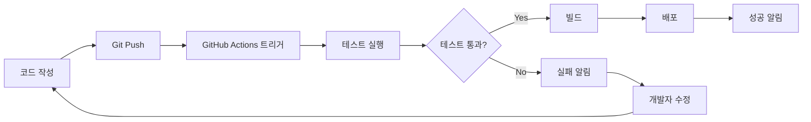

## 들어가며: 금요일 오후 6시의 악몽 😱

금요일 오후 6시, 드디어 새 기능 개발을 마치고 배포하려는 순간.

```bash
$ npm run build
$ scp -r dist/* user@server:/var/www/
$ ssh user@server
$ sudo systemctl restart nginx
# 어라... 뭔가 잘못됐다!
```

서버에 접속이 안 됩니다. 식은땀이 흐릅니다. 
로컬에서는 잘 되는데 왜 서버에서는 안 될까요? 
결국 밤 10시까지 디버깅하다가 알고 보니 환경 변수 하나를 빼먹었습니다.

> **이런 경험, 다들 한 번쯤 있으시죠?** 
> GitHub Actions CI/CD를 사용하면 이런 악몽에서 벗어날 수 있습니다! 🎉
{: .prompt-info }

## CI/CD가 뭐길래? 🤔

### 엘리베이터 피치로 설명하는 CI/CD

상사: "CI/CD가 뭐야?"

여러분: "**CI(Continuous Integration)**는 여러 개발자의 코드를 자동으로 합치고 테스트하는 거고, 
**CD(Continuous Deployment)**는 테스트를 통과한 코드를 자동으로 배포하는 겁니다. 
쉽게 말해, **'코드 푸시하면 알아서 테스트하고 배포까지 해주는 자동화 시스템'**이에요!"

### 수동 배포 vs 자동 배포

| 수동 배포 😵 | 자동 배포 😎 |
|------------|------------|
| 1. 코드 작성 | 1. 코드 작성 |
| 2. 로컬 테스트 | 2. Git Push |
| 3. 빌드 | 3. ☕ 커피 한 잔 |
| 4. 서버 접속 | 4. "배포 완료!" 알림 |
| 5. 파일 업로드 | |
| 6. 서비스 재시작 | |
| 7. 에러 확인 | |
| 8. 롤백 (실패 시) | |

### CI/CD 파이프라인 흐름도



## GitHub Actions 첫 걸음 👶

### 기본 구조 이해하기

GitHub Actions는 `.github/workflows/` 폴더에 YAML 파일을 만들어서 사용합니다.

```yaml
# .github/workflows/hello-world.yml
name: 안녕 세계!  # 워크플로우 이름

on:  # 언제 실행할지
  push:
    branches: [ main ]

jobs:  # 무엇을 할지
  say-hello:
    runs-on: ubuntu-latest  # 어디서 실행할지
    
    steps:  # 어떤 순서로 할지
      - name: 인사하기
        run: echo "안녕하세요, GitHub Actions! 👋"
```

이 파일을 커밋하고 푸시하면? 자동으로 실행됩니다! ✨

### 실제로 유용한 첫 번째 워크플로우

이제 진짜 쓸모있는 걸 만들어볼까요? **코드를 푸시할 때마다 자동으로 테스트를 실행**하는 워크플로우입니다.

```yaml
# .github/workflows/test.yml
name: 자동 테스트 🧪

on:
  push:
    branches: [ main, develop ]
  pull_request:
    branches: [ main ]

jobs:
  test:
    runs-on: ubuntu-latest
    
    steps:
      # 1. 코드 가져오기
      - name: 체크아웃
        uses: actions/checkout@v4
      
      # 2. Node.js 설치
      - name: Node.js 설정
        uses: actions/setup-node@v4
        with:
          node-version: '20'
          cache: 'npm'  # 의존성 캐싱으로 속도 UP!
      
      # 3. 의존성 설치
      - name: 패키지 설치
        run: npm ci
      
      # 4. 테스트 실행
      - name: 테스트 실행
        run: npm test
      
      # 5. 테스트 실패 시 알림 (선택사항)
      - name: 실패 알림
        if: failure()
        run: echo "테스트가 실패했어요! 😱"
```

## 실전! Next.js 앱 자동 배포하기 🚀

이제 진짜 배포를 자동화해봅시다. Vercel에 Next.js 앱을 배포하는 예제입니다.

### 준비물
1. Next.js 프로젝트
2. Vercel 계정
3. Vercel 토큰 (Settings → Tokens에서 생성)

### Step 1: GitHub Secrets 설정

GitHub 저장소 → Settings → Secrets and variables → Actions에서:
- `VERCEL_TOKEN`: Vercel에서 생성한 토큰
- `VERCEL_ORG_ID`: Vercel 팀 ID
- `VERCEL_PROJECT_ID`: Vercel 프로젝트 ID

> **🔐 보안 팁**: 절대로 토큰을 코드에 직접 넣지 마세요! 
> GitHub Secrets를 사용하면 안전하게 관리할 수 있습니다.
{: .prompt-warning }

### Step 2: 배포 워크플로우 작성

```yaml
# .github/workflows/deploy.yml
name: Vercel 자동 배포 🚀

on:
  push:
    branches: [ main ]

env:
  VERCEL_ORG_ID: ${{ secrets.VERCEL_ORG_ID }}
  VERCEL_PROJECT_ID: ${{ secrets.VERCEL_PROJECT_ID }}

jobs:
  deploy:
    runs-on: ubuntu-latest
    
    steps:
      - name: 코드 체크아웃
        uses: actions/checkout@v4
      
      - name: Node.js 설정
        uses: actions/setup-node@v4
        with:
          node-version: '20'
          cache: 'npm'
      
      - name: 의존성 설치
        run: npm ci
      
      - name: 빌드
        run: npm run build
      
      - name: Vercel CLI 설치
        run: npm install -g vercel
      
      - name: Vercel 배포 (프로덕션)
        run: |
          vercel pull --yes --environment=production --token=${{ secrets.VERCEL_TOKEN }}
          vercel build --prod --token=${{ secrets.VERCEL_TOKEN }}
          vercel deploy --prebuilt --prod --token=${{ secrets.VERCEL_TOKEN }}
```

### Step 3: PR 미리보기 배포

PR을 만들 때마다 미리보기 URL을 생성하는 것도 가능합니다!

```yaml
# .github/workflows/preview.yml
name: PR 미리보기 배포 👀

on:
  pull_request:
    types: [opened, synchronize]

jobs:
  preview:
    runs-on: ubuntu-latest
    
    permissions:
      pull-requests: write
    
    steps:
      - name: 코드 체크아웃
        uses: actions/checkout@v4
      
      - name: Vercel 미리보기 배포
        uses: amondnet/vercel-action@v25
        id: vercel-deploy
        with:
          vercel-token: ${{ secrets.VERCEL_TOKEN }}
          vercel-org-id: ${{ secrets.VERCEL_ORG_ID }}
          vercel-project-id: ${{ secrets.VERCEL_PROJECT_ID }}
      
      - name: PR에 댓글 달기
        uses: actions/github-script@v7
        with:
          script: |
            github.rest.issues.createComment({
              issue_number: context.issue.number,
              owner: context.repo.owner,
              repo: context.repo.repo,
              body: '🚀 미리보기가 배포되었습니다!\n' + 
                    '👉 URL: ${{ steps.vercel-deploy.outputs.preview-url }}'
            })
```

## 실무에서 자주 하는 실수들 🤦

### 1. 무한 루프 조심!

```yaml
# ❌ 이렇게 하면 안 돼요!
on:
  push:
    branches: [ main ]

jobs:
  update:
    steps:
      - name: 자동 커밋
        run: |
          git add .
          git commit -m "자동 업데이트"
          git push  # 이러면 다시 워크플로우가 실행됨!
```

**해결책**: `[skip ci]`를 커밋 메시지에 추가하거나, 봇 커밋은 무시하도록 설정

```yaml
# ✅ 올바른 방법
- name: 자동 커밋
  run: |
    git add .
    git commit -m "자동 업데이트 [skip ci]"
    git push
```

### 2. 비용 폭탄 방지하기 💸

GitHub Actions는 public 저장소는 무료지만, private 저장소는 매월 2,000분만 무료입니다.

```yaml
# 비용 절감 팁들
jobs:
  build:
    # 1. 필요한 경우에만 실행
    if: github.event_name == 'push' || 
        (github.event_name == 'pull_request' && 
         github.event.pull_request.draft == false)
    
    # 2. 타임아웃 설정
    timeout-minutes: 10
    
    steps:
      # 3. 캐싱 적극 활용
      - uses: actions/cache@v3
        with:
          path: ~/.npm
          key: ${{ runner.os }}-npm-${{ hashFiles('**/package-lock.json') }}
```

### 3. 디버깅 팁 🐛

워크플로우가 실패했을 때 디버깅하는 방법:

```yaml
# 디버깅용 스텝 추가
- name: 디버깅 정보 출력
  run: |
    echo "현재 브랜치: ${{ github.ref }}"
    echo "커밋 SHA: ${{ github.sha }}"
    echo "이벤트 이름: ${{ github.event_name }}"
    echo "환경 변수들:"
    env

# 특정 스텝 실패 시에만 실행
- name: 실패 시 로그 업로드
  if: failure()
  uses: actions/upload-artifact@v3
  with:
    name: error-logs
    path: |
      npm-debug.log
      yarn-error.log
```

## 고급 활용법: 매트릭스 빌드 🎯

여러 환경에서 동시에 테스트하고 싶다면?

```yaml
name: 크로스 플랫폼 테스트

on: [push]

jobs:
  test:
    strategy:
      matrix:
        os: [ubuntu-latest, windows-latest, macos-latest]
        node-version: [18, 20, 21]
        # 특정 조합 제외
        exclude:
          - os: windows-latest
            node-version: 18
    
    runs-on: ${{ matrix.os }}
    
    steps:
      - uses: actions/checkout@v4
      
      - name: Node.js ${{ matrix.node-version }} 설정
        uses: actions/setup-node@v4
        with:
          node-version: ${{ matrix.node-version }}
      
      - name: 테스트 실행
        run: |
          npm ci
          npm test
```

## 실전 프로젝트: 완벽한 CI/CD 파이프라인 🏗️

모든 것을 합친 완벽한 워크플로우를 만들어봅시다:

```yaml
# .github/workflows/complete-pipeline.yml
name: 완벽한 CI/CD 파이프라인 🚀

on:
  push:
    branches: [ main, develop ]
  pull_request:
    branches: [ main ]

env:
  NODE_VERSION: '20'

jobs:
  # 1단계: 코드 품질 검사
  quality:
    name: 코드 품질 검사 🔍
    runs-on: ubuntu-latest
    
    steps:
      - uses: actions/checkout@v4
      
      - name: Node.js 설정
        uses: actions/setup-node@v4
        with:
          node-version: ${{ env.NODE_VERSION }}
          cache: 'npm'
      
      - name: 의존성 설치
        run: npm ci
      
      - name: ESLint 실행
        run: npm run lint
      
      - name: Prettier 검사
        run: npm run format:check
      
      - name: TypeScript 타입 체크
        run: npm run type-check

  # 2단계: 테스트
  test:
    name: 테스트 실행 🧪
    needs: quality  # quality 작업이 성공해야 실행
    runs-on: ubuntu-latest
    
    steps:
      - uses: actions/checkout@v4
      
      - name: Node.js 설정
        uses: actions/setup-node@v4
        with:
          node-version: ${{ env.NODE_VERSION }}
          cache: 'npm'
      
      - name: 의존성 설치
        run: npm ci
      
      - name: 단위 테스트
        run: npm run test:unit
      
      - name: 통합 테스트
        run: npm run test:integration
      
      - name: 테스트 커버리지 리포트
        uses: codecov/codecov-action@v3
        with:
          token: ${{ secrets.CODECOV_TOKEN }}

  # 3단계: 빌드
  build:
    name: 빌드 🏗️
    needs: test
    runs-on: ubuntu-latest
    
    steps:
      - uses: actions/checkout@v4
      
      - name: Node.js 설정
        uses: actions/setup-node@v4
        with:
          node-version: ${{ env.NODE_VERSION }}
          cache: 'npm'
      
      - name: 의존성 설치
        run: npm ci
      
      - name: 프로덕션 빌드
        run: npm run build
      
      - name: 빌드 결과물 업로드
        uses: actions/upload-artifact@v3
        with:
          name: build-files
          path: dist/

  # 4단계: 배포 (main 브랜치만)
  deploy:
    name: 프로덕션 배포 🚀
    needs: build
    if: github.ref == 'refs/heads/main' && github.event_name == 'push'
    runs-on: ubuntu-latest
    
    steps:
      - uses: actions/checkout@v4
      
      - name: 빌드 결과물 다운로드
        uses: actions/download-artifact@v3
        with:
          name: build-files
          path: dist/
      
      - name: Vercel 배포
        run: |
          npm install -g vercel
          vercel deploy --prod --token=${{ secrets.VERCEL_TOKEN }}
      
      - name: 슬랙 알림
        uses: 8398a7/action-slack@v3
        with:
          status: ${{ job.status }}
          text: '프로덕션 배포가 완료되었습니다! 🎉'
          webhook_url: ${{ secrets.SLACK_WEBHOOK }}
        if: always()
```

## 보너스: 유용한 Actions 모음 🎁

### 1. 자동 라벨링
PR 파일 변경사항에 따라 자동으로 라벨 추가:

```yaml
# .github/labeler.yml
frontend:
  - src/**/*
  - '*.jsx'
  - '*.tsx'

backend:
  - api/**/*
  - server/**/*

documentation:
  - '*.md'
  - docs/**/*
```

### 2. 자동 리뷰어 할당
```yaml
# .github/CODEOWNERS
# 프론트엔드 파일은 @frontend-team이 리뷰
/src/ @frontend-team
/components/ @frontend-team

# 백엔드 파일은 @backend-team이 리뷰
/api/ @backend-team
/server/ @backend-team
```

### 3. 스케줄링 작업
```yaml
name: 매일 아침 상태 체크

on:
  schedule:
    # 매일 오전 9시 (UTC 0시)
    - cron: '0 0 * * *'

jobs:
  health-check:
    runs-on: ubuntu-latest
    steps:
      - name: 웹사이트 상태 확인
        run: |
          response=$(curl -s -o /dev/null -w "%{http_code}" https://mysite.com)
          if [ $response != "200" ]; then
            echo "웹사이트가 다운되었습니다! 😱"
            exit 1
          fi
```

## 트러블슈팅 가이드 🔧

### 자주 발생하는 에러와 해결법

**1. "Permission denied" 에러**
```yaml
# 해결: 실행 권한 추가
- name: 스크립트 실행
  run: |
    chmod +x ./scripts/deploy.sh
    ./scripts/deploy.sh
```

**2. "Cannot find module" 에러**
```yaml
# 해결: 캐시 클리어 또는 npm ci 사용
- name: 의존성 설치
  run: |
    npm cache clean --force
    npm ci  # npm install 대신 ci 사용
```

**3. "Resource not accessible by integration" 에러**
```yaml
# 해결: 권한 추가
permissions:
  contents: read
  pull-requests: write  # PR 댓글 작성 시 필요
```

## 비용 계산 예시 💰

실제로 얼마나 들까요?

### Private 저장소 기준
- **무료 한도**: 2,000분/월
- **초과 비용**: $0.008/분

### 사용 예시
```
일일 배포: 5분 × 30일 = 150분
PR 테스트: 3분 × 100개 = 300분
정기 작업: 2분 × 30일 = 60분
--------------------------------
총 사용량: 510분 (무료 한도 내)
```

### 최적화 후
```
캐싱 적용: 빌드 시간 5분 → 2분
조건부 실행: PR 100개 → 50개
--------------------------------
총 사용량: 210분 (74% 절감!)
```

## 보안 베스트 프랙티스 🔒

### 1. Secrets 관리
```yaml
# ❌ 절대 하지 마세요
env:
  API_KEY: "sk-1234567890abcdef"  # 위험!

# ✅ 올바른 방법
env:
  API_KEY: ${{ secrets.API_KEY }}
```

### 2. Third-party Actions 사용
```yaml
# ❌ 태그 없이 사용 (위험)
uses: some-action

# ✅ 특정 버전 고정
uses: some-action@v2.1.0

# ✅✅ 커밋 SHA로 고정 (가장 안전)
uses: some-action@8a9b7c
```

### 3. 최소 권한 원칙
```yaml
permissions:
  contents: read  # 읽기만 필요한 경우
  # write 권한은 꼭 필요한 경우만
```

## 마무리: 이제 당신도 CI/CD 마스터! 🎓

축하합니다! 이제 여러분은:

✅ CI/CD의 개념을 이해했습니다  
✅ GitHub Actions 기본 사용법을 익혔습니다  
✅ 실제 프로젝트에 적용할 수 있는 워크플로우를 만들 수 있습니다  
✅ 일반적인 문제들을 해결할 수 있습니다  

### 다음 단계는?

1. **모니터링 추가**: Sentry, DataDog 등과 연동
2. **보안 스캔**: Dependabot, CodeQL 활용
3. **성능 테스트**: Lighthouse CI로 성능 추적
4. **멀티 환경 배포**: 개발/스테이징/프로덕션 환경 분리

### 기억하세요!

> **"자동화는 게으름이 아니라 효율성입니다."** 
> 
> 반복적인 작업을 자동화하고, 
> 절약한 시간을 더 가치 있는 일에 투자하세요! 🚀
{: .prompt-tip }

### 추가 학습 자료

- [GitHub Actions 공식 문서](https://docs.github.com/actions)
- [Awesome Actions 컬렉션](https://github.com/sdras/awesome-actions)
- [GitHub Actions 마켓플레이스](https://github.com/marketplace?type=actions)

---

*GitHub Actions로 CI/CD를 구축하면서 겪은 경험이나 궁금한 점이 있다면 댓글로 공유해주세요! 
함께 더 나은 자동화 파이프라인을 만들어가요.* 💪

*이 포스트는 AI Assistant가 작성했습니다. 실제 개발 경험을 바탕으로 한 실용적인 가이드를 제공하고자 노력했습니다.* 