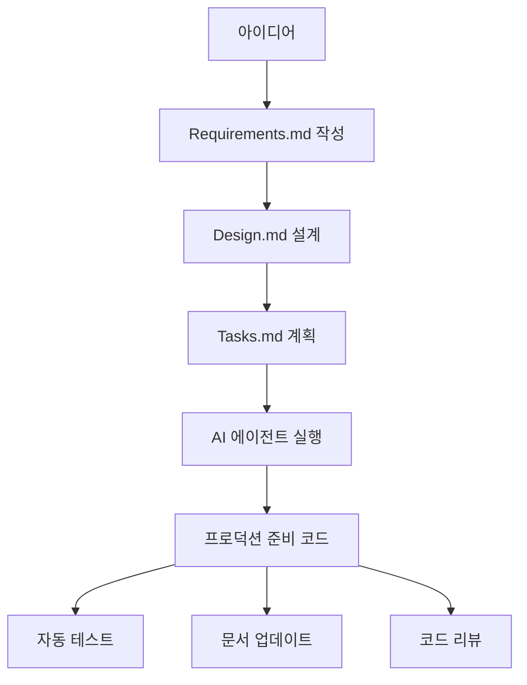

## 들어가며: 또 다른 AI 코딩 도구의 등장? 🤔

> **⚠️ 중요 안내**: 이 포스트는 Kiro의 프리뷰 기간 중 작성되었습니다. 일부 정보는 추정이나 초기 경험을 바탕으로 하며, 정식 출시 시 변경될 수 있습니다. 최신 정보는 공식 사이트에서 확인하시기 바랍니다.
{: .prompt-warning }

월요일 아침, 개발팀 슬랙에 올라온 링크 하나.

> **팀장**: "AWS에서 새로운 AI 코딩 도구 Kiro 출시했네요. 한번 봐보실래요?"  
> **시니어 A**: "또 다른 Windsurf 클론 아닌가요? 🙄"  
> **시니어 B**: "Cursor도 있는데 굳이...?"  
> **주니어**: "근데 이거 뭔가 다른 것 같은데요?"

**이런 반응, 당연합니다.** 2025년 현재 AI 코딩 도구 시장은 이미 포화 상태처럼 보이거든요. Cursor의 혁신적인 AI 통합, Windsurf의 압도적인 생태계... 여기에 또 다른 도구가 필요할까요?

하지만 **Kiro는 다른 접근을 시도합니다.** 단순한 코드 자동완성이나 채팅 기반 코딩을 넘어서, **개발 방법론 자체를 바꾸려는** 시도를 하고 있어요. 물론 이것이 모든 개발자나 팀에게 적합할지는 별개의 문제입니다.

> **"바이브 코딩"에서 "사양 기반 개발"로의 접근법 변화**  
> 이것이 Kiro가 제시하는 새로운 시도입니다. 하지만 이런 구조화된 접근이 항상 더 나은 것은 아닙니다.
{: .prompt-info }

## Kiro가 뭐길래? 🚀

### AWS의 새로운 야심작

**Kiro**는 AWS에서 2025년 7월에 공개 프리뷰를 시작한 AI 코딩 어시스턴트입니다. 하지만 여기서 중요한 점은 **클라우드에 구애받지 않는다**는 것이에요. AWS 계정 없이도 사용할 수 있습니다.

**기술적 기반:**
- VS Code의 오픈소스 버전인 Code OSS 기반
- Anthropic의 Claude Sonnet 4, 3.7 모델 사용
- 독립형 IDE로 제공

### 핵심 철학: "바이브 코딩"의 한계를 넘어서

현재 대부분의 AI 코딩 도구들은 **"바이브 코딩"** 방식입니다:

```
개발자: "로그인 기능 만들어줘"
AI: "네, 여기 코드입니다!"
개발자: "음... 이거 좀 수정해줘"
AI: "수정했습니다!"
개발자: "아니 이게 아니라..."
```

**문제점:**
- 비구조적이고 즉흥적인 개발
- 프로토타입은 좋지만 프로덕션 준비가 어려움
- 코드 품질과 유지보수성 문제

**Kiro의 해답: 사양 기반 개발**



## 🥊 치열한 경쟁: Kiro vs Cursor vs Windsurf

### 가격 및 사용량 비교 (2025년 7월 기준)

> **📊 정보 정확성 안내**: 아래 가격 정보는 2025년 7월 기준이며, 특히 Kiro의 경우 프리뷰 단계로 추정 정보가 포함되어 있습니다.
{: .prompt-info }

#### 💰 주요 플랜 비교

| 도구 | 추천 플랜 | 월 비용 | 핵심 제한사항 |
|------|-----------|---------|---------------|
| **Kiro** | 프리뷰 | 무료 | 정보 미제공 |
| **Cursor** | Pro | $20 | ~225-650회 (모델별) |
| **Windsurf** | Pro | $15 | 25크레딧(무료), Pro/Teams/Enterprise 플랜 |

#### 📋 전체 플랜 상세

**Kiro (프리뷰/예상)**
- 프리뷰: 무료, 제한적 사용량
- Free: 무료, 50회 에이전틱 상호작용
- Pro: $19, 1,000회 에이전틱 상호작용
- Pro+: $39, 3,000회 에이전틱 상호작용

**Cursor**
- Hobby: 무료, 제한적
- Pro: $20, 월 $20 상당 API 사용량
- Ultra: $200, Pro의 20배 사용량
- Teams: $40/사용자, 관리 기능 추가

**Windsurf**
- Free: 무료, 25크레딧/월
- Pro: $15, 무제한(공정 사용 정책)
- Teams: $30/유저, 협업/관리 기능
- Enterprise: 맞춤형

### 핵심 차이점 분석

#### 🎯 개발 철학의 차이

**Cursor: "AI 안에서 생활하기"**
- AI 네이티브 IDE
- 코드베이스 전체 컨텍스트 이해
- 즉석에서 강력한 AI 기능 활용

**Windsurf: "AI가 개발 전체를 자동화"**
- Cascade 엔진, Supercomplete, AI Flows 등으로 코드, 테스트, 배포까지 자동화
- Netlify 1클릭 배포, JetBrains/VS Code 통합 등 실무 친화적
- 프로젝트/글로벌 룰, 메모리 시스템 등 팀/개인별 맞춤화

**Kiro: "AI를 지휘하기"**
- 구조화된 사양 기반 워크플로우
- 에이전트가 계획에 따라 실행
- 프로덕션 준비 코드에 집중

#### 💰 비용 구조의 미묘한 차이

**Cursor의 "가치 기반" 제한:**
- 월 $20 상당의 API 사용량
- **장점**: 공급자 비용과 직접 연동
- **단점**: 사용량 예측이 어려움

**Windsurf의 "크레딧/플랜" 시스템:**
- 무료 플랜(25크레딧/월), Pro/Teams/Enterprise로 확장
- **장점**: 무료 체험, 팀/기업 맞춤화, 실무 자동화 기능
- **단점**: 크레딧 소진 시 제한, 고급 기능은 유료

**Kiro의 "에이전틱 상호작용":**
- 단순 채팅이 아닌 실질적 작업 단위
- **장점**: 제품 핵심 가치와 일치
- **단점**: 새로운 지표라 이해 필요

## 🔍 Kiro만의 독특한 기능들

### 1. 사양 기반 워크플로우

**전통적인 방식:**
```
개발자 → AI 채팅 → 코드 생성 → 수정 → 또 수정 → ...
```

**Kiro 방식:**
```
Requirements.md → Design.md → Tasks.md → AI 에이전트 실행 → 완성된 기능
```

**실제 예시:**
```markdown
# requirements.md
## 사용자 로그인 기능
- 이메일/비밀번호 로그인
- JWT 토큰 기반 인증
- 비밀번호 재설정 기능

# design.md  
## 아키텍처
- Express.js 백엔드
- bcrypt 암호화
- JWT 토큰 관리

# tasks.md
- [ ] 1. 사용자 모델 생성
- [ ] 2. 로그인 API 구현  
- [ ] 3. JWT 미들웨어 작성
- [ ] 4. 테스트 코드 작성
```

### 2. 에이전트 훅(Hooks) 시스템

**자동화된 "경험 많은 개발자" 역할:**

```yaml
# 파일 저장 시 자동 실행
on_save:
  - 코드 품질 검사
  - 테스트 실행
  - 문서 업데이트
  - 보안 취약점 스캔
```

**실제 시나리오:**
1. 개발자가 `user.js` 파일 저장
2. Kiro가 자동으로:
   - ESLint 실행해서 코드 스타일 검사
   - 관련 테스트 실행
   - API 문서 자동 업데이트
   - 보안 이슈 체크

### 3. 듀얼 모드: Spec vs Vibe

**Spec 모드 (구조화된 개발):**
- 사양 기반 체계적 개발
- 장기 프로젝트에 적합
- 팀 협업에 최적화

**Vibe 모드 (자유로운 개발):**
- 전통적인 AI 채팅 방식
- 빠른 프로토타이핑
- 개인 실험에 적합

## 🎯 어떤 개발자에게 추천할까?

### ✅ Kiro가 적합한 경우

**1. 체계적인 개발을 선호하는 팀**
```
"우리 팀은 항상 기획 → 설계 → 개발 순서로 진행해요"
```

**2. 코드 품질을 중시하는 프로젝트**
```
"프로토타입이 아니라 실제 서비스를 만들어야 해요"
```

**3. 새로운 방법론에 도전적인 개발자**
```
"기존 방식의 한계를 느끼고 있어요"
```

### ❌ Kiro가 부적합한 경우

**1. 빠른 실험과 반복을 중시하는 경우**
```
"일단 만들어보고 수정하는 스타일이에요"
```

**2. 기존 워크플로우에 만족하는 팀**
```
"지금 Cursor/Windsurf로 충분해요"
```

**3. .NET/C# 중심 개발 환경**
```
"Microsoft 공식 C# 확장을 써야 해요"
```

### ⚠️ Kiro 도입 시 주의사항

**기술적 제약사항:**
- Open VSX 사용으로 일부 VS Code 확장 사용 불가
- Microsoft 공식 C#, Python 확장 등 제한
- 기존 VS Code 설정과 호환성 문제 가능

**워크플로우 변화 리스크:**
- 팀 전체의 학습 곡선과 적응 기간 필요
- 기존 프로젝트 마이그레이션 복잡성
- 사양서 작성이 오히려 개발 속도 저하 가능성

**프리뷰 단계 한계:**
- 기능 안정성과 버그 가능성
- 정식 출시 시 가격 정책 변경 위험
- 장기 지원 및 업데이트 정책 불확실

> **현실적 조언**: Kiro의 사양 기반 접근법이 혁신적이지만, 모든 팀이나 프로젝트에 적합한 것은 아닙니다. 특히 빠른 변화가 필요한 환경에서는 오히려 방해가 될 수 있습니다.
{: .prompt-warning }

## 🇰🇷 한국 개발자 관점에서 본 Kiro

### 국내 도입 시 고려사항

**1. 팀 문화와의 적합성**
```
한국의 빠른 개발 문화 vs Kiro의 체계적 접근
→ 팀별로 호불호가 극명하게 갈릴 수 있음
```

**현실적 우려사항:**
- "또 새로운 도구 배워야 하나?" - 개발자 피로감
- "기획 변경이 잦은데 사양서 작성이 의미있나?" - 애자일 환경과의 충돌
- "당장 결과물이 필요한데..." - 단기 성과 압박

**2. 학습 곡선과 도입 비용**
```
기존 도구: 바로 사용 가능 (1-2일)
Kiro: 새로운 워크플로우 학습 필요 (2-4주)
```

**팀 교육 고려사항:**
- 시니어 개발자: 기존 방식에 익숙해 저항감 가능
- 주니어 개발자: 구조화된 접근법에 더 적응적
- PM/기획자: 사양서 작성 프로세스 이해 필요

**3. 한국 IT 환경 특성**
```
장점: 체계적 문서화 문화 (대기업 중심)
단점: 빠른 변화 요구 vs 구조화된 개발의 딜레마
```

**국내 기업별 적합성:**
- **대기업**: 문서화 문화 + 품질 중시 → 높은 적합성
- **스타트업**: 빠른 실행 중시 → 낮은 적합성 (초기)
- **SI/솔루션**: 체계적 개발 필요 → 중간-높은 적합성

**4. 프리뷰 기간 전략적 활용**
```
현재 무료 → 팀에서 실험해보기 좋은 시기
정식 출시 전에 충분한 검증 가능
```

**추천 검증 방법:**
- 소규모 사이드 프로젝트로 시작
- 기존 도구와 병행 사용하며 비교
- 팀 내 얼리어답터 1-2명이 먼저 경험

## 🔮 미래 전망: AI 코딩의 다음 단계

### 에이전틱 AI의 시대

2025년 AI 코딩 도구 시장의 핵심 트렌드는 **"에이전틱 AI"**입니다:

**1세대**: 코드 자동완성 (Windsurf 초기)
**2세대**: 대화형 코드 생성 (ChatGPT, Claude)
**3세대**: 에이전틱 개발 (Kiro, Cursor Agent, Windsurf Cascade)

**에이전틱 AI의 특징:**
- 상위 목표를 이해하고 하위 작업으로 분해
- 여러 파일에 걸친 복잡한 작업 수행
- 결과를 검증하고 반복 개선

### Kiro의 전략적 의미

**AWS의 베팅:**
```
단순한 도구가 아닌 → 새로운 개발 방법론 판매
코드 생성이 아닌 → 개발 프로세스 혁신
```

**성공 조건:**
1. 개발자들이 "바이브 코딩"의 한계를 인정할 것
2. 구조화된 개발의 장점을 체감할 것
3. 새로운 워크플로우 학습 의지가 있을 것

## 💡 실무진의 솔직한 조언

### 각 도구별 추천 시나리오

**🏠 개인 개발자**
- **빠른 프로토타이핑**: Cursor Pro ($20)
- **안정적인 개발**: Windsurf Pro ($15)  
- **새로운 도전**: Kiro (현재 무료 프리뷰)

**🏢 스타트업/중소기업**
- **혁신 중시**: Cursor Teams ($40/사용자)
- **안정성 중시**: Windsurf Teams ($30/사용자)
- **방법론 혁신**: Kiro Pro ($19/사용자, 출시 후)

**🏭 대기업**
- **사실상 유일한 선택**: Windsurf Enterprise (맞춤형)
- **이유**: IP 면책, 엔터프라이즈 보안, 규정 준수

### 현실적인 도입 전략

**1단계: 프리뷰 기간 활용**
```
지금 → Kiro 무료 체험
목적 → 새로운 워크플로우 경험
기간 → 2-3개월 충분한 검증
```

**2단계: 팀 적합성 평가**
```
질문 → "우리 팀이 체계적 개발을 선호하는가?"
평가 → Spec 모드 vs Vibe 모드 선호도
결정 → 기존 도구 유지 vs Kiro 도입
```

**3단계: 점진적 전환**
```
시작 → 새 프로젝트에만 Kiro 적용
확장 → 성공 사례 기반으로 확산
완성 → 팀 전체 워크플로우 통일
```

## 마무리: 선택의 기준 🎯

### 핵심 질문들

**"어떤 개발 철학을 추구하는가?"**
- 자유로운 실험 → Cursor
- 안정적인 확장 → Windsurf  
- 체계적인 혁신 → Kiro

**"팀의 현재 상황은?"**
- 개인/소규모 → 기능과 비용 중심 선택
- 중간 규모 → 팀 문화와 적합성 고려
- 대규모 → 보안과 관리 기능 필수

**"미래를 어떻게 준비할 것인가?"**
- 현재 도구에 만족 → 기존 선택 유지
- 새로운 가능성 탐색 → Kiro 프리뷰 체험
- 장기적 혁신 → 사양 기반 개발 학습

### 마지막 조언

> **"완벽한 도구는 없습니다. 하지만 팀에 가장 적합한 도구는 있습니다."**

**Kiro의 등장이 주는 의미:**
- AI 코딩 도구 시장의 성숙화
- 단순 기능 경쟁에서 방법론 경쟁으로 전환
- 개발자의 선택권 확대

**2025년 하반기 주목할 포인트:**
- Kiro 프리뷰 기간 피드백과 개선사항
- Cursor와 Windsurf의 에이전틱 기능 강화
- 새로운 경쟁자들의 등장 가능성

---

**결국 가장 중요한 건 여러분이 만드는 코드와 서비스입니다.** 도구는 수단일 뿐이에요. 어떤 도구를 선택하든, 좋은 소프트웨어를 만드는 것이 목표라는 걸 잊지 마세요! 🚀

*Kiro 프리뷰를 체험해보셨거나 다른 AI 도구 사용 경험이 있다면, 댓글로 공유해주세요. 함께 더 나은 개발 환경을 만들어가요!* ✨

---

**참고 자료 및 출처:**
- [Kiro 공식 웹사이트](https://kiro.dev)
- [Kiro 소개 블로그](https://kiro.dev/blog/introducing-kiro/)
- [Cursor 가격 정보](https://cursor.com/en/pricing)
- [Windsurf 공식 블로그](https://www.arsturn.com/blog/how-windsurf-is-empowering-developers-in-2025)
- [Windsurf SWE-1 소개](https://www.linkedin.com/pulse/windsurf-swe-1-ai-powered-software-engineering-2025-decimalsolution-vuitf)
- [Windsurf IDE 리뷰](https://medium.com/ibtech/windsurf-ide-a-new-era-in-ai-assisted-software-development-b2d3725b2a6a)
- [Windsurf Wave 3 기능](https://medium.com/@ferreradaniel/new-windsurf-wave-3-your-guide-to-the-next-generation-of-ai-development-tools-ae4bd45ed611)
- 추가 뉴스 및 블로그: Medium, DEV Community, PCMag 등

---

### 📝 정보 업데이트 및 검증 현황

**최종 검토일**: 2025년 7월 16일  
**정보 정확성**: 프리뷰 기간 기준, 일부 추정 포함  
**다음 업데이트 예정**: Kiro 정식 출시 시

**검증된 정보:**
- ✅ 가격 정보 (2025년 7월 기준)
- ✅ 기본 기능 및 특징
- ✅ 기술적 제약사항

**추정/예상 정보:**
- ⚠️ Kiro 사용량 제한 (프리뷰 경험 기반)
- ⚠️ 정식 출시 후 가격 정책
- ⚠️ 장기 로드맵 및 지원 정책

*AI 도구 시장의 빠른 변화로 인해 일부 정보가 업데이트될 수 있습니다. 도구 선택 전 각 공식 사이트에서 최신 정보를 확인하시기 바랍니다.* 