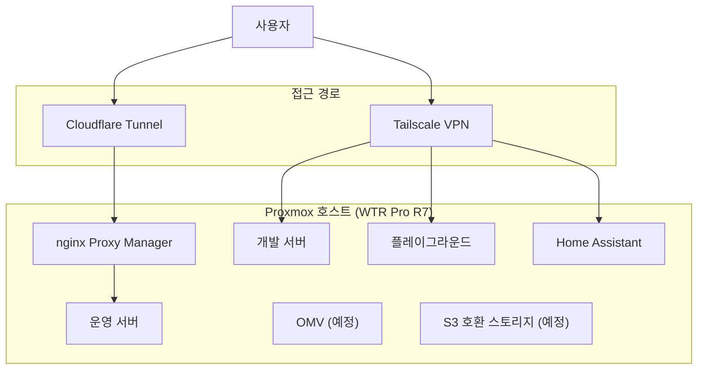

Vercel에 올리면 배포가 몇 초면 끝난다. AWS를 쓰면 웬만한 서비스는 이미 관리형으로 나와 있다. 그런데도 나는 7~8년째 집 한구석에 서버를 켜 두고 있다. 이유를 한 문장으로 말하기는 어렵지만, 굳이 말하자면 "직접 만지고 싶어서"에 가깝다.

## 시작한 계기

처음 시작한 건 순전히 재미였다. 취미 삼아 싱글보드 컴퓨터 하나를 사서 뭔가를 올려본 게 시작이었고, 그게 지금까지 이어졌다. 클라우드였다면 버튼 몇 번으로 끝날 일을, 굳이 케이스를 열고 부품을 만지고 네트워크를 잡아가며 했다. 그 과정 자체가 인프라를 몸으로 이해하는 방법이었다.

## 확장의 여정

하드웨어는 그동안 네 번 바뀌었지만, 바뀐 이유는 대부분 비슷하다. 지금 구성으로는 하고 싶은 걸 다 못 태운다는 느낌이 들 때마다 다음 단계로 넘어갔다. 처음에는 개인 웹서버 하나와 Nextcloud 정도가 전부였다. 지금은 Proxmox를 올려서 그 위에 여러 서비스를 가상화해 운영한다. 결국 하드웨어를 바꾼 건 스펙이 아니라 "얼마나 태울 수 있느냐"의 문제였다.

지금 구조를 그려보면 이렇다. 공개할 서비스는 Cloudflare Tunnel과 nginx Proxy Manager를 거쳐 나가고, 나만 쓰는 개발 서버나 플레이그라운드, HA는 Tailscale VPN 뒤에 숨겨 둔다.

지금은 WTR Pro R7 한 대 위에, 이 모든 게 스토리지 10TB 남짓과 함께 올라가 있다. OMV와 S3 호환 스토리지는 아직 도구를 정하지 못해 예정으로만 남아 있다.

## 클라우드였으면 없었을 경험

클라우드였다면 겪지 않았을 일도 있다. 정전이 나면 서버가 그대로 꺼진다. 집 인터넷이 끊기면 외부에서 접근하던 모든 서비스가 같이 끊긴다. AWS라면 리전과 가용영역이 알아서 처리해줄 문제를, 여기서는 내가 직접 원인을 찾고 복구해야 한다. 불편한 건 맞는데, 그 불편함이 인프라가 왜 이중화되고 왜 리전이 나뉘는지를 몸으로 알게 해줬다.

## 비용 관점

비용은 의외로 크지 않다. 초기에는 월 전기세가 500원 정도였고, 지금 쓰는 장비로는 1,000원 정도 나간다. 초기 투자금을 빼면 클라우드 사용료와 비교할 규모조차 아니다. 물론 이건 "싸게 먹힌다"는 계산이라기보다, 그만큼 가볍게 켜 두고 계속 실험할 수 있다는 뜻에 더 가깝다.

## 그래서 왜 계속 하는가

그래서 여전히 홈랩을 한다. 관리형 서비스가 해주는 걸 못 미더워해서가 아니라, 그 뒤에서 무슨 일이 일어나는지 알고 싶어서다. 정전과 장애를 겪으며 인프라를 이해하고, 확장하고 싶을 때마다 장비를 바꾸며 손으로 익힌 것들은 클라우드 콘솔만 봐서는 남지 않는다.
